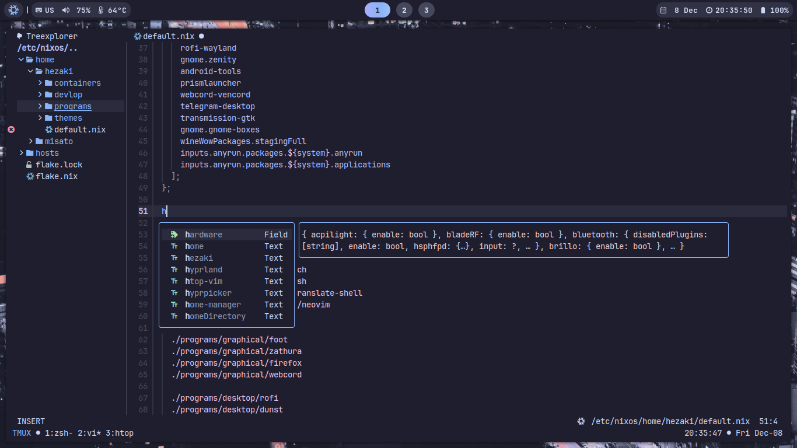
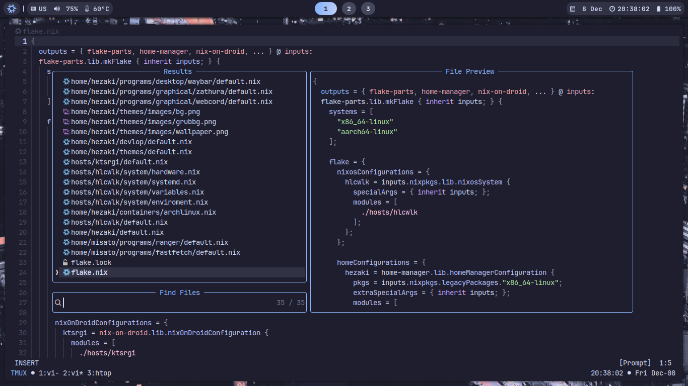
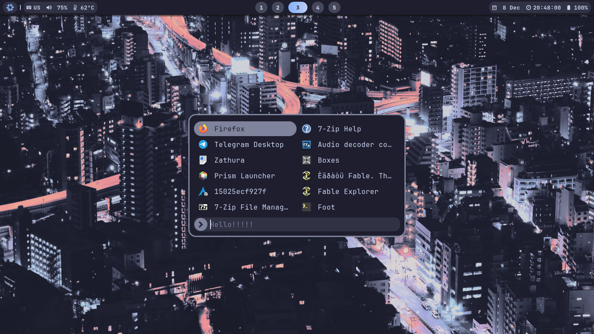
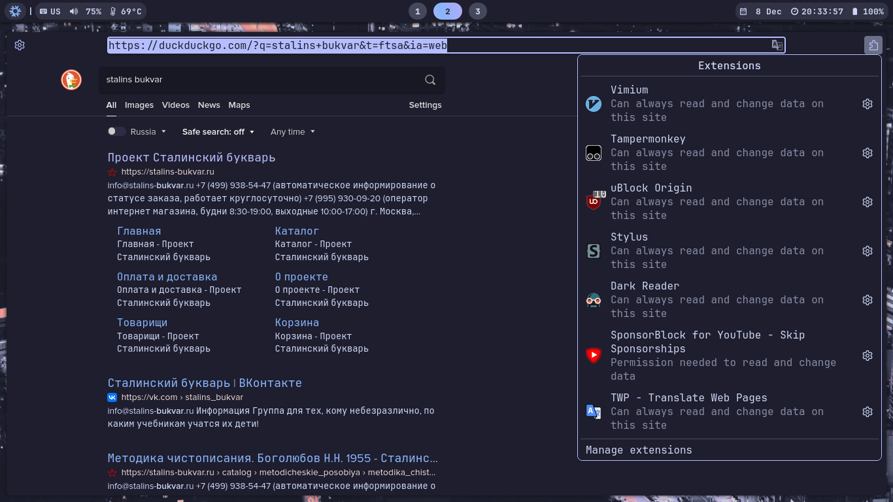
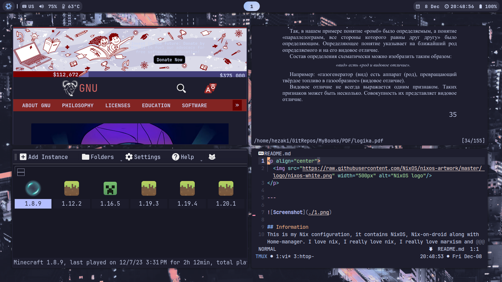
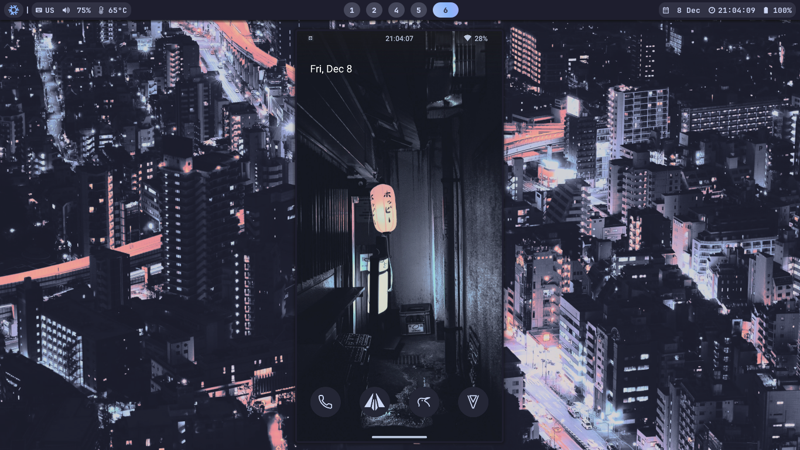

<p align="center">
  
</p>

---


## Information
This is my Nix configuration, it contains NixOS, Nix-on-droid along with Home-manager. I love nix, I really love nix, I really love marxism and nix.

Build host:
```bash
nixos-rebuild switch --flake .#hlcwlk   # or nixos-update
```

Build nix-on-droid:
```bash
nix-on-droid switch --flake .#ktsrgi    # or nix-update
```

Build home-manager:
```bash 
home-manager switch --flake .#hezaki    # or home-update
```

To make the home-manager work:
```bash 
doas chown -R hezaki:users /etc/nixos  
``` 

<details>
  <summary><b>Software</b></summary>
<br>

- **Wayland compositor** - [Hyprland](https://hyprland.org/)
- **Bar** - [Waybar](https://github.com/Alexays/Waybar)
- **Browser** - [Firefox](https://www.mozilla.org/)
- **Terminal** - [Foot](https://codeberg.org/dnkl/foot)
- **Editor** - [Neovim](https://neovim.io/)
- **Shell** - [Zsh](https://www.zsh.org/)
- **Notifications** - [Dunst](https://github.com/dunst-project/dunst)
- **Launcher** - [Rofi](https://github.com/lbonn/rofi)
- **Wallpaper** - `home/hezaki/themes/images/`

<br></details>

<details>
  <summary><b>Plans</b></summary>
<br>

- [ ] Create a script to run the config

</br></details>

<details>
  <summary><b>More screenshots</b></summary>
<br>

* Neovim 

* Telescope.nvim

* Rofi

* Firefox

* Plugin [hycov](https://github.com/DreamMaoMao/hycov)

* Scrcpy


</br></details>
## Thanks 
- [Thank you for your help <3](https://codeberg.org/ghosty)
- [Beautiful neovim configuration](https://github.com/Manas140/Conscious/tree/main)