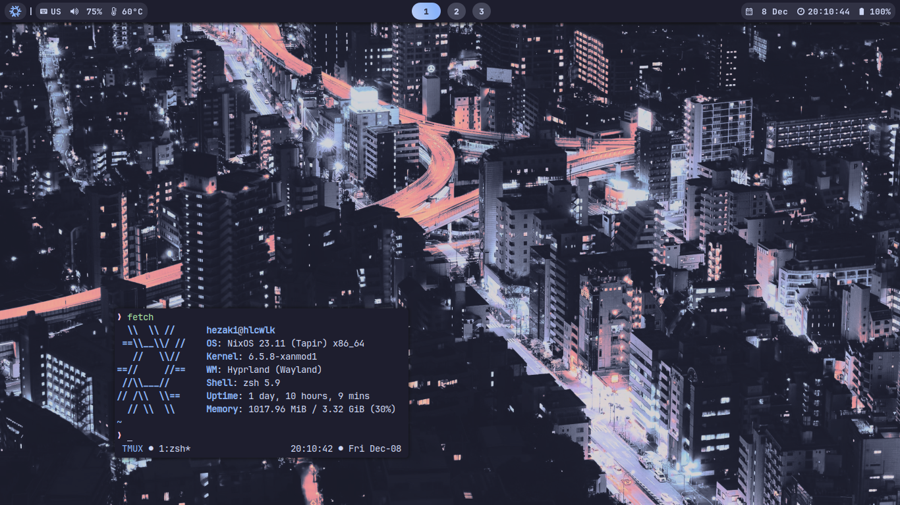
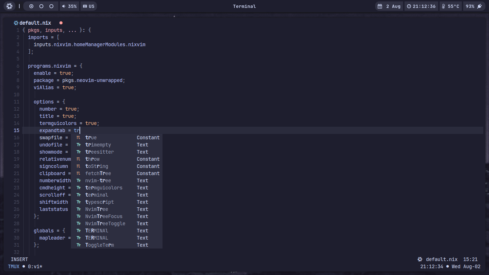
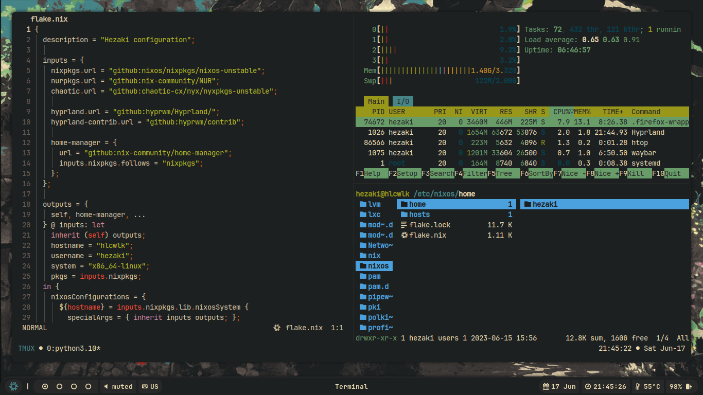

<p align="center">
  
</p>

## <p align="center">Hezaki Dotfiles</p>





### Information
This is my NixOS configuration, it is divided into nixosConfiguration and homeConfiguration, you can build them separately.

Build host:
```bash
nixos-rebuild switch --flake .#hlcwlk
```
But you can use aliases:
```bash 
nixos-update
```
Build home-manager:
```bash 
home-manager switch --flake .#hezaki
```
And similarly:
```bash 
home-update
```
To make the home-manager work:
```bash 
sudo chown -R hezaki:users /etc/nixos/home  
``` 

### Software
- **Wayland compositor** - [Hyprland](https://hyprland.org/)
- **Bar** - [Waybar](https://github.com/Alexays/Waybar)
- **Browser** - [Firefox](https://www.mozilla.org/)
- **Terminal** - [Foot](https://codeberg.org/dnkl/foot)
- **Editor** - [Neovim](https://neovim.io/)
- **Shell** - [Zsh](https://www.zsh.org/)
- **Notifications** - [Dunst](https://github.com/dunst-project/dunst)
- **Launcher** - [Rofi](https://github.com/lbonn/rofi)
- **Wallpaper** - `.github/wallpaper.png`

### Plans
1. - [ ] Add a new host for ARM.
1. - [ ] Add local packages.
1. - [ ] Update hyprland config.
1. - [ ] Install nix-colors. :)

### Thanks 
- [Beautiful neovim configuration](https://github.com/Manas140/Conscious/tree/main)
- [Thank you for your help](https://codeberg.org/ghosty)
