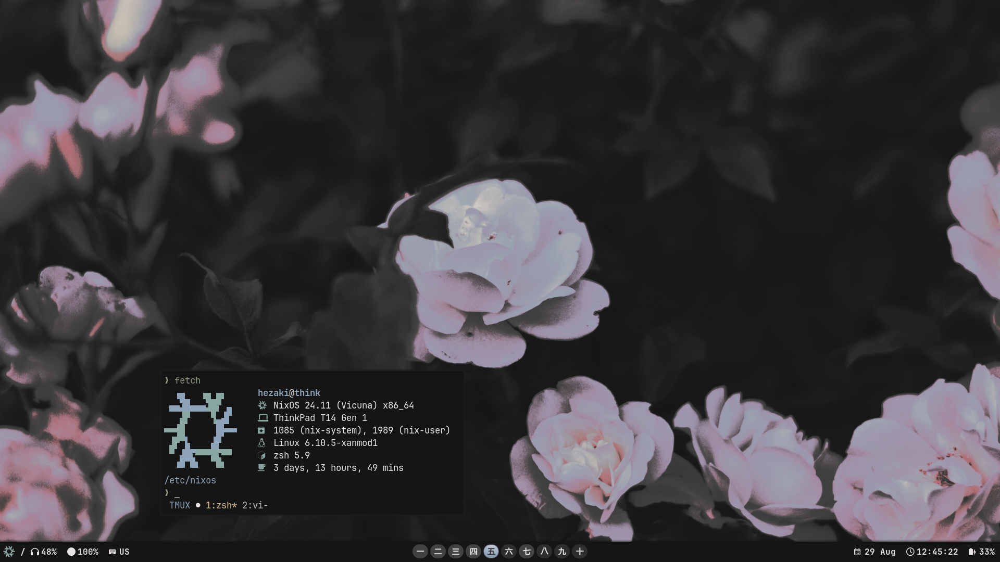

<h1 align="center"> Touka </h1>

<p align="center">
This is my Nix configuration, for desktop and a small configuration for android
</p>



## ℹ️ Information

Build host:
```bash
nixos-rebuild switch --flake .#hlcwlk   # or nixos-update
```

Build home-manager on desktop:
```bash 
home-manager switch --flake .#hezaki    # or home-update
```

To make the home-manager work:
```bash 
doas chown -R hezaki:users /etc/nixos  
``` 

Why Touka? I'm just a big fan of [Touka Kirishima](https://tokyoghoul.fandom.com/wiki/Touka_Kirishima) from Tokyo Ghoul)))

<details>
  <summary><b>Software</b></summary>
<br>

- **Wayland compositor** - [Hyprland](https://hyprland.org/)
- **Bar** - [Waybar](https://github.com/Alexays/Waybar)
- **Browser** - [Firefox](https://www.mozilla.org/)
- **Terminal** - [Foot](https://codeberg.org/dnkl/foot)
- **Editor** - [Emacs](https://www.gnu.org/software/emacs/)
- **Shell** - [Zsh](https://www.zsh.org/)
- **Notifications** - [Swaync](https://github.com/ErikReider/SwayNotificationCenter)
- **Launcher** - [Anyrun](https://github.com/Kirottu/anyrun)
- **Wallpapers** - `home/hezaki/themes/images/`

<br></details>

<details>
  <summary><b>Plans</b></summary>
<br>

- [ ] Make extended readme and rewrite it in org
- [ ] Create a script to run the config

</br></details>

## ❤️ Thanks 
- [Thank you for your help <3](https://codeberg.org/ghosty)
- [Beautiful neovim configuration](https://github.com/Manas140/Conscious/tree/main)
