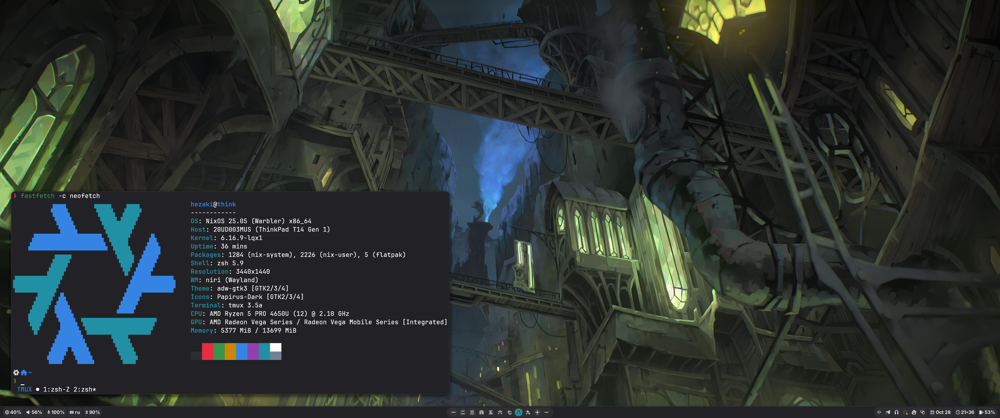

<h1 align="center">Touka</h1>
<p align="center">This is my nonfemboy Nix configuration</p>


## ℹ️Information
I recommend using  [nh](https://github.com/viperML/nh), if you don't have it then:
``` bash
nix shell nixpkgs#nh
```

Build host:
``` bash
nh os switch . -a                         # or nixos-rebuild switch --flake .#think
```

Build home-manager on desktop:
``` bash
nh home switch . -a                       # or home-manager switch --flake .#hezaki
```
To make the home-manager work:

``` bash
doas chown -R hezaki:users /etc/nixos     # if you use this path
```

Why Touka? I'm just a big fan of [Touka Kirishima](https://tokyoghoul.fandom.com/wiki/Touka_Kirishima)  from TK)))

## 💻Hardware
- Laptop — [Lenovo ThinkPad T14 gen 1](https://www.lenovo.com/us/en/p/laptops/thinkpad/thinkpadt/t14-amd-g1/22tpt14t4a2)
	- An excellent office laptop, there is a profile in [nixos-hardware](https://github.com/NixOS/nixos-hardware/blob/master/lenovo/thinkpad/t14/amd/gen1)
- Mouse — [Logitech G304](https://www.logitechg.com/en-ph/products/gaming-mice/g304-lightspeed-wireless-gaming-mouse.910-005284.html)
	- Wireless mouse, works great with Linux, [libratbag](https://github.com/libratbag/libratbag) supports it 

## 📚Layout
- [flake.nix](flake.nix) main configuration file
- [home](home) home-manager configuration
	- [hezaki](home/hezaki) main user configuration
		- [programs](home/hezaki/programs) there are all programs for this user
			- [desktop](home/hezaki/programs/desktop) everything that is responsible for the environment
				- [anyrun](https://github.com/Kirovez/anyrun) app runner
				- [fusuma](https://github.com/iberianpig/fusuma) custom gestures touchpad
				- [cliphist](https://github.com/sentriz/cliphist) clipboard history
				- [hyprland](https://hyprland.org/) wayland compositor
				- [niri](https://github.com/YaLTeR/niri) wayland compositor
				- [hyprlock](https://github.com/hyprwm/hyprlock) screenlocker
				- [portals](https://flatpak.github.io/xdg-desktop-portal/) config xdg
				- [swayimg](https://github.com/artemsen/swayimg) best image viewer
				- [swaync](https://github.com/ErikReider/SwayNotificationCenter) notification
				- [waybar](https://github.com/Alexays/Waybar) bar
				- [udiskie](https://github.com/coldfix/udiskie) automount
			- [devlop](home/hezaki/programs/devlop) developer utils
			- [graphical](home/hezaki/programs/graphical) gui programs
				- [blockbench](https://www.blockbench.net/) low-poly 3D model editor
				- [browsers](home/hezaki/programs/graphical/browsers) blowsers
					- [firefox](https://www.mozilla.org/firefox/) the best browser that has created humanity, I hate it
					- [chromium](https://www.chromium.org/) cummimum
				- [foot](https://codeberg.org/dnkl/foot) terminal!
				- [games](home/hezaki/programs/graphical/games) ИГРЫ БЛЯТЬ, ИГРЫ
					- [terraria](https://terraria.org/) i like
				- [kitty](https://sw.kovidgoyal.net/kitty/) terminal!!
				- [mangohud](https://github.com/flightlessmango/MangoHud) (pearhud) overlay monitoring FPS
				- [mpv](https://mpv.io/) best media player
				- [obs-studio](https://obsproject.com/) video recorder and more
				- [obsidian](https://obsidian.md/) only 10 pieces
				- [prismlauncher](https://prismlauncher.org/) best minecraft launcher
				- [telegram](https://telegram.org/) messenger!
				- [vesktop](https://github.com/Vencord/Vesktop) best discord client
				- [zathura](https://pwmt.org/projects/zathura/) pdf-reader! I can't live without him
				- [kdeconnect](https://kdeconnect.kde.org/) sync with phone
			- [terminal](home/hezaki/programs/terminal) terminal utils
				- [anicliru](https://github.com/AnicliRu/Anicli-Ru) some kind of Russian shit
				- [bat](https://github.com/sharkdp/bat) alt cat
				- [btop](https://github.com/aristocratos/btop) a monitor of resources 
				- [cava](https://github.com/karlstav/cava) avac
				- [editors](home/hezaki/programs/terminal/editors) how without it
					- [emacs](https://www.gnu.org/software/emacs/) editor for pussyboy
					- [neovim](https://neovim.io/) the best text editor
				- [espanso](https://espanso.org/) text expander
				- [fastfetch](https://github.com/fastfetch-cli/fastfetch) fetch like neofetch
				- [fd](https://github.com/sharkdp/fd) alt find on rust
				- [fzf](https://github.com/junegunn/fzf) fuzzy finder!
				- [git](https://git-scm.com/) config for git
				- [lazygit](https://github.com/jesseduffield/lazygit) for very lazy
				- [lsd](https://github.com/lsd-rs/lsd) alt ls on rust
				- [pandoc](https://pandoc.org/) universal markup converter 
				- [ripgrep](https://github.com/BurntSushi/ripgrep) alt grep on rust
				- [shell](home/hezaki/programs/terminal/shell) shell!!!
					- [translate-shell](https://github.com/soimort/translate-shell) terminal translator
					- [zsh](https://www.zsh.org/) best shell
				- [tmux](https://github.com/tmux/tmux/wiki) terminal multiplexer
				- [yazi](https://github.com/sxycode/yazi) terminal file manager
				- [yt-dlp](https://github.com/yt-dlp/yt-dlp) to download any shit
				- [zoxide](https://github.com/ajeetdsouza/zoxide) smarter sd command
		- [themes](home/hezaki/themes) stylix configuration
			- [images](home/hezaki/themes/images) wallpapers!
- [hosts](hosts) maybe configuration for hosts?
	- [think](hosts/think) config for my thinkpad
		- [enviroment](hosts/think/enviroment) all the most necessary, lol
			- [fonts](hosts/think/enviroment/fonts) where without them
			- [home-manager](hosts/think/enviroment/home-manager) basic config home-manager itself
			- [local](hosts/think/enviroment/local) locale-gen
			- [network](hosts/think/enviroment/network) setting network
			- [nix](hosts/think/enviroment/nix) setting nix
			- [programs](hosts/think/enviroment/programs) utils on host
			    - [clamav](https://www.clamav.net/) antivirus
			    - [flatpak](https://flatpak.org/) declarative flatpak
				- [k3s](https://k3s.io/) kubernetes
				- [kanata](https://github.com/jtroo/kanata) keyboard remapper
				- [nh](https://github.com/viperML/nh) yet another nix cli helper
				- [nix-ld](https://github.com/NixOS/nixpkgs/blob/master/pkgs/build-support/setup-hooks/nix-ld/README.md) run bin
				- [openvpn](https://openvpn.net/) ovpn
                - [polkit](https://www.freedesktop.org/software/polkit/docs/latest/) polkit setting
                - [podman](https://podman.io/) rootless docker containers
                - [steam](https://store.steampowered.com/) steam client
		- [filesystem](hosts/think/filesystem) file system configuration!
		- [hardware](hosts/think/hardware) hardware settings for my thinkpad
			- [battery](hosts/think/hardware/battery) battery setting
			- [graphic](hosts/think/hardware/graphic) responsible for graphics
			- [periphery](hosts/think/hardware/periphery) setting up my periphery
			- [tweaks](hosts/think/hardware/tweaks) all sorts of tweaks for "optimization"
		- [systemd](hosts/think/systemd) OH NO

 ## ❤️ Thanks 
- [Thank you for your help <3](https://codeberg.org/ghosty)
- [Beautiful neovim configuration](https://github.com/Manas140/Conscious/tree/main)
